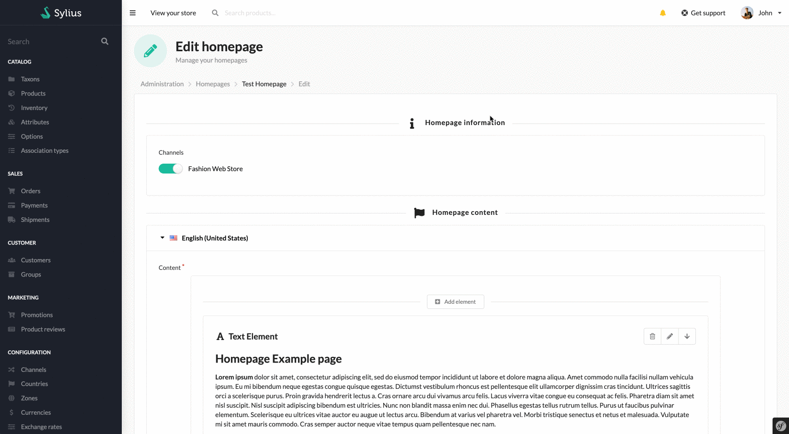
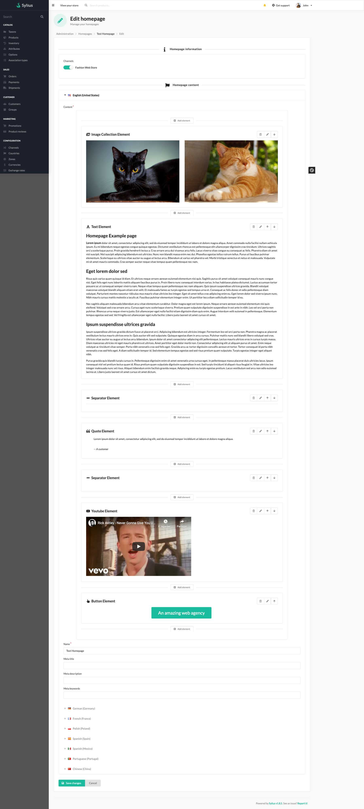
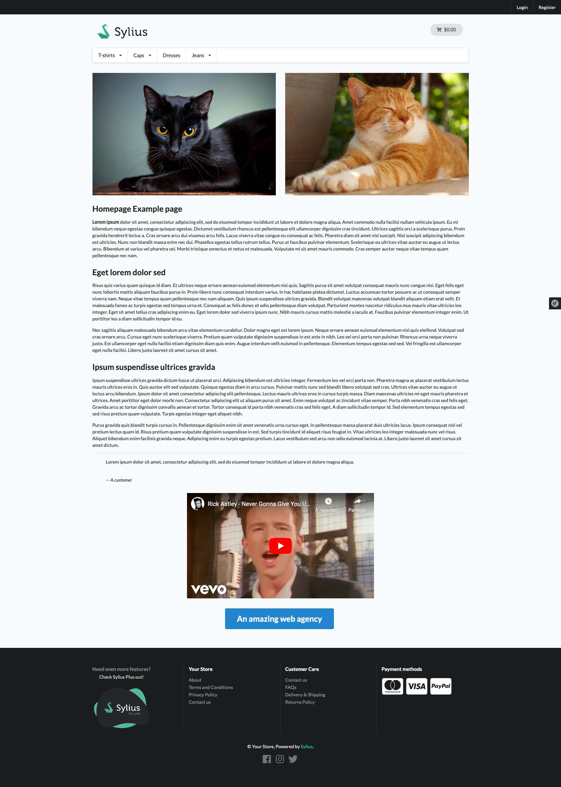

[](https://monsieurbiz.com/agence-web-experte-sylius)

<h1 align="center">Sylius Homepages</h1>

[](https://github.com/monsieurbiz/SyliusHomepagePlugin/blob/master/LICENSE.txt)
[](https://github.com/monsieurbiz/SyliusHomepagePlugin/actions?query=workflow%3ATests)
[](https://github.com/monsieurbiz/SyliusHomepagePlugin/actions?query=workflow%3ASecurity)
[](https://github.com/monsieurbiz/SyliusHomepagePlugin/actions?query=workflow%3ASecurity)


This plugins allows you to manage your homepages using the Rich Editor.

If you want to know more about our editor, see the [Rich Editor Repository](https://github.com/monsieurbiz/SyliusRichEditorPlugin)



## Compatibility

| Sylius Version | PHP Version     |
|----------------|-----------------|
| 1.12           | 8.1 - 8.2 - 8.3 |
| 1.13           | 8.1 - 8.2 - 8.3 |
| 1.14           | 8.1 - 8.2 - 8.3 |

## Installation

If you want to use our recipes, you can configure your composer.json by running:

```bash
composer config --no-plugins --json extra.symfony.endpoint '["https://api.github.com/repos/monsieurbiz/symfony-recipes/contents/index.json?ref=flex/master","flex://defaults"]'
```

```bash
composer require monsieurbiz/sylius-homepage-plugin
```

If you do not use the recipes : 

Change your `config/bundles.php` file to add the line for the plugin : 

```php
<?php

return [
    //..
    MonsieurBiz\SyliusHomepagePlugin\MonsieurBizSyliusHomepagePlugin::class => ['all' => true],
];
```

Then create the config file in `config/packages/monsieurbiz_sylius_homepage_plugin.yaml` :

```yaml
imports:
    - { resource: "@MonsieurBizSyliusHomepagePlugin/Resources/config/config.yaml" }
```

Finally import the routes in `config/routes/monsieurbiz_sylius_homepage_plugin.yaml` : 

```yaml
monsieurbiz_sylius_homepage_admin:
    resource: "@MonsieurBizSyliusHomepagePlugin/Resources/config/routes/admin.yaml"
    prefix: /%sylius_admin.path_name%

monsieurbiz_sylius_homepage_homepage:
    path: /{_locale}/
    methods: [GET]
    requirements:
        _locale: ^[a-z]{2}(?:_[A-Z]{2})?$
    defaults:
        _controller: monsieurbiz_homepage.controller.homepage::indexAction
        _sylius:
            template: '@MonsieurBizSyliusHomepagePlugin/Homepage/index.html.twig'
            repository:
                method: findOneByChannelAndLocale
                arguments:
                    - "expr:service('sylius.context.channel').getChannel()"
                    - "expr:service('sylius.context.locale').getLocaleCode()"
```

### Migrations

Make a doctrine migration diff : 

```php
bin/console doctrine:migrations:diff
```

Then run it : 

```php
bin/console doctrine:migrations:migrate
```

## Example of complete homepage

### Admin form with preview



### Front display



## Create custom elements

You can customize and create custom elements in your page.  
In order to do that, you can check the [Rich Editor custom element creation](https://github.com/monsieurbiz/SyliusRichEditorPlugin#create-your-own-elements)

## SEO Friendly

You can define for your homepage the meta title, meta description and meta 
keywords.

## Contributing

You can open an issue or a Pull Request if you want! 😘  
Thank you!
